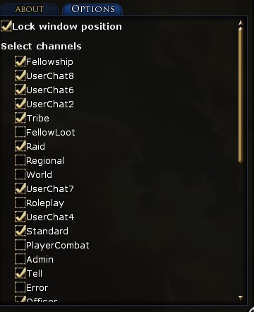

# Chat Notif

A simple LOTRO plugin to display chat messages.

## Installation guide

1. Download the latest release from [Github](https://github.com/LilianHiault/ChatNotif/releases/latest)
2. Unzip the content of the zip file to your `The Lord of the Rings Online\Plugins\` folder (for example `C:\Users\USER\Documents\The Lord of the Rings Online\Plugins\`)
3. Launch the game and in the plugin panel load `ChatNotif`

## Features

Displays notification for chat messages.

In the option pannel, you can unlock the window to move it and select the channels to be displayed.

## Planned features

- Options
  - [x] ~~Select channels~~
  - [x] ~~Lock / unlock option~~
    - [x] ~~Change the opacity of the window~~
    - [x] ~~Enable mouse drag to move the window~~
  - [x] ~~Set notification duration~~
  - [ ] Set font size
  - [ ] Set font colour
  - [ ] Save settings by character/server/account
  - [x] ~~Sort channels in the channel list~~
- Notification window
  - [ ] Fade in and out
  - [ ] Don't display messages sent by the player
  - [x] ~~Message duration based on the length of the text.~~
  - [ ] Don't display notifications if UI is hidden
- Commands
  - [x] ~~Better debug messages~~
- [ ] New logo
