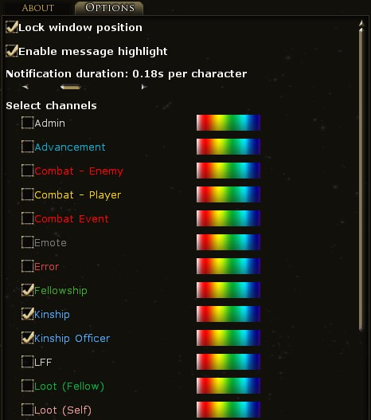
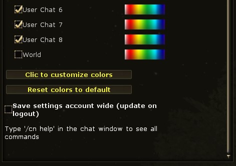

# Chat Notif

A simple LOTRO plugin to display chat messages larger on your screen.

## Installation guide

1. Download the latest release from [Github](https://github.com/EsyArda/ChatNotif/releases/latest) of [lotroInterface](https://www.lotrointerface.com/downloads/info1208).
2. Unzip the content of the zip file to your `The Lord of the Rings Online\Plugins\` folder (for example `C:\Users\USER\Documents\The Lord of the Rings Online\Plugins\`).
3. Launch the game, open the plugin manager and load `ChatNotif`.

## Features

**NEW: Complete French translation! There is now a highlight feature to help you see new messages!**

Displays simple notification for chat messages.

![Animated GIF from LOTRO with the message '[To test] Hello world!' in the centre.](./ChatNotif/res/hello-world.gif)

In the Options panel, you can unlock the window to move it around and select which channels to display.
You can customize the color for each channel.

You can change the speed in the Options window.
The duration is based on the length of the text.
Settings can be saved for your character or for the entire account.

Some additional features are available from the command line.
Type `/cn help` to see all available commands.

## Versions

* Version 1.7.0: Complete French translation, highlight text messages, default chat colors matching the game, corrected channel names to match the game options, new minimum and maximum display time and better debug messages.
* Version 1.6.0: It is now possible to change channel colors!
* Version 1.5.0: Added a new option to save and load settings account wide.
* Version 1.4.1-1: Corrected the LotroInterface download file.
* Version 1.4.1: The icon is now displayed correctly.
* Version 1.4.0: New icon added, the license is included in the LotroInterface release.
* Version 1.3.0: Does not display notifications when the UI is hidden.
* Version 1.2.2: Fixed an error when loading settings on French and German clients.
* Version 1.2.1: Channels are now correctly sorted by name in the option panel.
* Version 1.2.0: Change notification duration.
* Version 1.1.1: Improved command line.
* Version 1.1.0: Window position is now saved in settings, added support for Plugin Compendium.
* Version 1.0.0: Initial release.

## Planned features

- [ ] Option to set font size
- [ ] Option to hide messages sent by the player
- [ ] Messages fade in and out
- [ ] Highlight messages when they appear
- [ ] Translate the plugin into German
